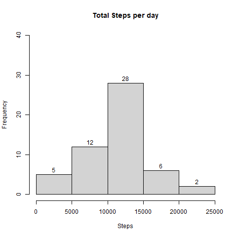
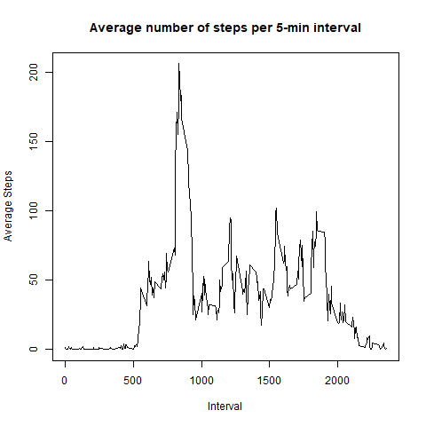
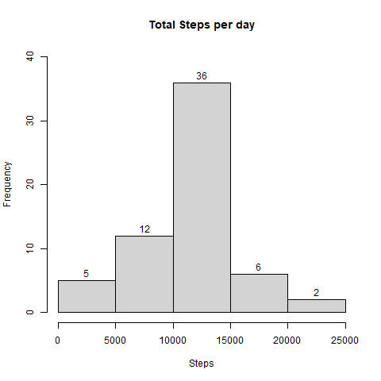
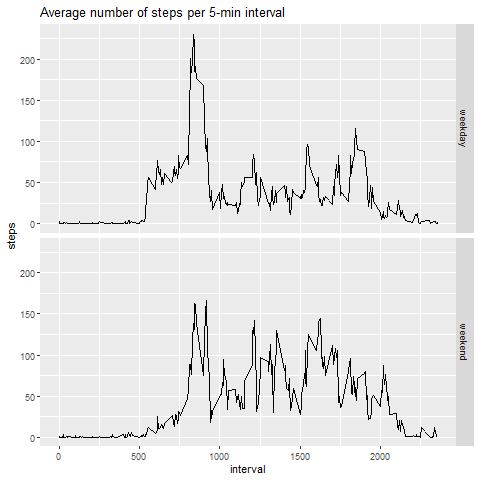

---
output:
  pdf_document: default
  html_document: default
---
**"Reproducible Research - Project 1"**
Author: "Anirban Chatterjee"
Date: "10/10/2020"
Output: html_document

# Set Up Environment


```r
library(readr)
library(tidyr)
library(dplyr)
library(ggplot2)
library(knitr)
```


# 1. Code for reading in the dataset and/or processing the data
Unzip and read the data from the GitHub repository. Dimensional exploration.


```r
unzip("repdata_data_activity.zip")
activity <- read.csv("activity.csv")
head(activity)
```

```
##   steps       date interval
## 1    NA 2012-10-01        0
## 2    NA 2012-10-01        5
## 3    NA 2012-10-01       10
## 4    NA 2012-10-01       15
## 5    NA 2012-10-01       20
## 6    NA 2012-10-01       25
```

```r
sapply(activity, class)
```

```
##       steps        date    interval 
##   "integer" "character"   "integer"
```

```r
activity <- transform(activity, date = as.Date(date))
```

# 2.Histogram of the total number of steps taken each day

```r
steps_per_day <- aggregate(steps ~ date, activity, sum, na.rm = TRUE)#aggregate steps per day and remove NA
hist(steps_per_day$steps, main = "Total Steps per day", xlab = "Steps", ylim = c(0,40), labels = TRUE)#create the plot
```



# 3. Mean and median number of steps taken each day


```r
mean(steps_per_day$steps)
```

```
## [1] 10766.19
```

```r
median(steps_per_day$steps)
```

```
## [1] 10765
```
 

# 4. Time series plot of the average number of steps taken

```r
mean_steps_interval <- aggregate(steps ~ interval, activity, mean, na.rm = TRUE)
#Aggregate data for time series plot, remove NA’s
plot(mean_steps_interval$interval, mean_steps_interval$steps, type = "l", main = "Average number of steps per 5-min interval", xlab = "Interval", ylab = "Average Steps") #Create time series plot
```




# 5. The 5-minute interval that, on average, contains the maximum number of steps

```r
max_interval <- mean_steps_interval$interval[which(mean_steps_interval$steps == max(mean_steps_interval$steps))]
max_interval
```

```
## [1] 835
```

# 6. Code to describe and show a strategy for imputing missing data

Missing values by variable

```r
sum(is.na(activity))
```

```
## [1] 2304
```
Devise a strategy for filling in missing data values.


```r
imputed_data <- activity #I will replace NA’s with the mean for that 5-minute interval.
for (i in 1:length(imputed_data$steps)) {
  if (is.na(imputed_data$steps[i])) {
    imputed_data$steps[i] <- mean_steps_interval$steps[mean_steps_interval$interval == imputed_data$interval[i]]
  }
}
```
# 7. Histogram of the total number of steps taken each day after missing values are imputed
Aggregate the filled data and make sure there are no NA steps

```r
imp_steps_per_day <- aggregate(steps ~ date, imputed_data, sum, na.rm = TRUE)
sum(is.na(imp_steps_per_day$steps))
```

```
## [1] 0
```
Create the plot

```r
hist(imp_steps_per_day$steps, main = "Total Steps per day", xlab = "Steps", ylim = c(0,40), labels = TRUE)
```


The mean is the same as the mean of the data calculated with remove.na = TRUE, because we filled in all of the missing values with that mean. The median is slightly higher, which is expected. The imputed data histogram is the same basic shape as the previous one, with higher frequencies at the mean. This makes sense because we filled in the NA values with the mean, so would have more frequency there. The mean and median are also now equal.

```r
mean(imp_steps_per_day$steps)
```

```
## [1] 10766.19
```

```r
median(imp_steps_per_day$steps)
```

```
## [1] 10766.19
```

# 8. Panel plot comparing the average number of steps taken per 5-minute interval across weekdays and weekends
Add a factor variable that will be either weekend or weekday, and create aggregate for plot

```r
imputed_data$date <- as.Date(imputed_data$date)
imputed_data$wkdy <- "weekday"
imputed_data$wkdy[weekdays(imputed_data$date) == "Saturday" | weekdays(imputed_data$date) == "Sunday"] <- "weekend"
imputed_data$wkdy <- as.factor(imputed_data$wkdy)
imputed_data_interval <- aggregate(steps ~ interval + wkdy, imputed_data, mean, na.rm = TRUE)
```
Create the panel plot

```r
g <- ggplot(imputed_data_interval, aes(interval, steps))
g + facet_grid(wkdy ~ .) + geom_line() + ggtitle("Average number of steps per 5-min interval")
```




